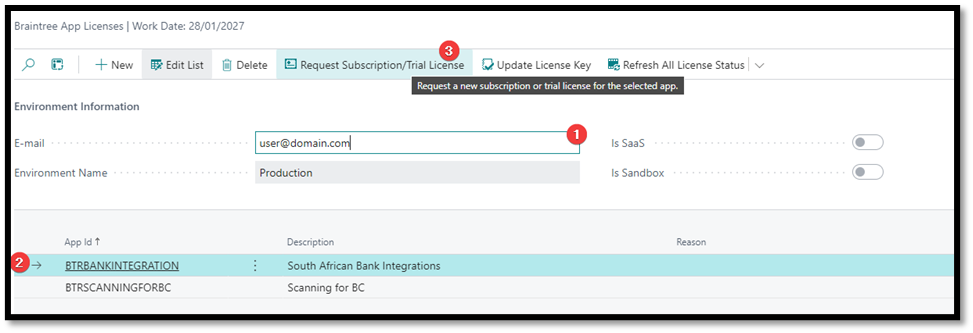
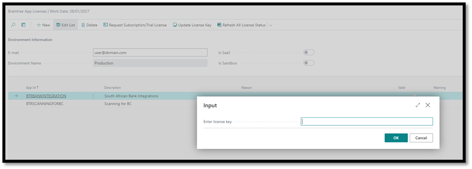

## Setup and Configuration

- [Activation](#activation)
- [Integration Setup](#integration-setup)
- [Commodity Codes](#commodity-codes)
- [ZRA VAT Types](#zra-vat-types)
- [VAT Product Posting Groups](#vat-product-posting-groups)
- [VAT Posting Setups](#vat-posting-setups)
- [Reason Codes](#reason-codes)
- [Payment Methods](#payment-methods)
- [User Management](#user-management)

Before using the Braintree ZRA Smart Invoice Connector, you need to set up and configure the system. This involves:

- Installing the extension in your Business Central environment
- Licensing the extension with a valid license key
- Configuring the system settings, such as the ZRA tax code and integration setup
- Setting up user accounts and permissions

>The following system settings need to be configured.

### Activation

In Business Central, search for and open “Braintree App Licenses”

 

1.	Enter your e-mail address
2.	Select the `ZRA Smart Invoice Connector` entry
3.	Click Request Subscription/Trial License

We will activate an evaluation license and send it to the email address you specified. The mail will contain a license key. Copy that license key then return to the Braintree App Licenses.

 

1.	Select the `ZRA Smart Invoice Connector` entry
2.	Click Update License Key
3.	Enter the key on the page that opens and click Ok. You should get a message that states “Thank you for registering”

### Integration Setup

1. Open the ZRA Integration Setup menu.
2. Enter the following fields 
    1. **API Key**
    2. **SDC ID**
3. **Production Enabled**: If disabled, it uses the sandbox environment for testing. If enabled, it uses the production environment for live transactions. You will not be able to enable this in a SaaS Sandbox environment.
4. Lastly, **Enable** the integration

#### Additional Integration Setup fields:

- **Prefix on Purchase Description**: Adds the line sequence number as a prefix to Purchase Line descriptions.
- **Prefix on Sales Description**: Adds the line sequence number as a prefix to Sales Line descriptions.
- **Purch. Accept Duplicate Response**: Treats duplicate purchase invoice responses from Fiscal Edge as successful integrations. (The purchase api sometimes responds with a duplicate response even when the integration was successful, this setting allows the system to treat those responses as successful integrations instead of failed ones.)

>The user can download a copy of ZRA Codes used for mapping in the system as described in this document.

### Commodity Codes
Import the commodities list from the ZRA Item Category List. This might take some time, as there is more than 149000 records in the list that has to be imported.

### ZRA VAT Types
A predefined list is created when the extension is installed. This list can be modified as required. 

Description of fields:

- **Code**: Unique identifier
- **Value**: A secondary identifier.
- **Blocked**: *Not used yet, reserved for future use.* 
- **Requires recommended Retail Price**: When enabled, requires items to be registered with a recommended retail price when this code is used on a transaction.

### VAT Product Posting Groups
Link Zambian Tax Codes to VAT Product Posting Groups. This is the code used for Items when registering them with ZRA.

### VAT Posting Setups
Link Zambian Tax Codes to VAT Posting Setup. These are the Tax codes used on document lines when the document is submitted to ZRA.

### Reason Codes
Map the predefined reason codes to the Reason Codes in Business Central.

### Payment Methods
Map supplier defined codes to the existing Payment Methods in Business Central.

### User Management 
Two Permission Sets have been added:

1. ZRA ALL BTR – For administrators of the integration, that are allowed to change the configuration.
2. ZRA BASIC BTR – For all other users, so that the integration can happen in the background.

>The system also maintains a list of users and assigns a unique integer to each user as required by the ZRA interface. This should not require any maintenance by an administrator.

[**⬆️ Back to Top**](#integration-setup) &nbsp;&nbsp;&nbsp;&nbsp; [**🏠 Home**](/ZRA-Documentation)